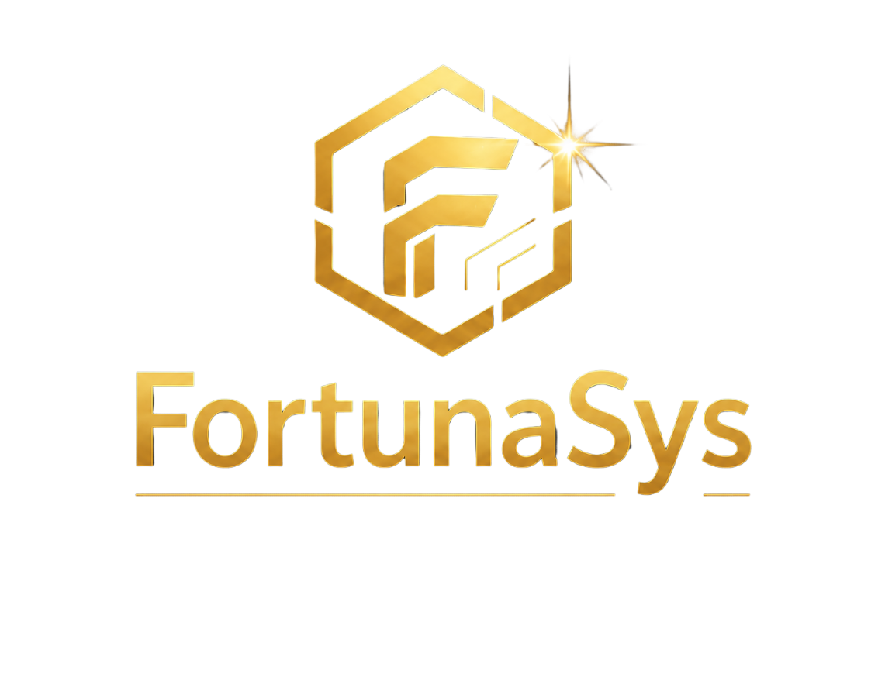

# 🎰 FortunaSys — Elite Bingo Management

**FortunaSys** é uma plataforma de gestão de bingos de alto padrão, projetada para oferecer uma experiência "Elite Pro" tanto para vendedores quanto para administradores. Com uma estética minimalista **Obsidian & Gold**, o sistema combina performance, segurança e usabilidade mobile-first.

---

## 💎 Diferenciais Elite

*   **Estética Premium**: Interface desenvolvida com *Glassmorphism*, paleta de cores neutra (#050505 & #D4AF37) e tipografia moderna (Space Grotesk & Bebas Neue).
*   **Arquitetura Ultra-Portátil**: Sistema consolidado em um único arquivo de alta performance, facilitando a distribuição e execução imediata.
*   **Sincronização em Nuvem**: Integração em tempo real com **Supabase** para persistência de vendas e auditoria simultânea.
*   **Foco na Experiência**: Notificações discretas, animações fluidas com Framer Motion e sistema de sorteio de brindes integrado.

---

## 🚀 Funcionalidades Principais

### 📱 Central de Vendas (Mobile-First)
*   Interface otimizada para smartphones.
*   Registro instantâneo de compradores e vendedores.
*   Validação de cartelas em tempo real (evita duplicidade).
*   Máscaras de entrada inteligentes para WhatsApp.

### 🛠️ Painel de Auditoria & Central de Comando
*   Acesso restrito via credenciais administrativas.
*   Estatísticas em tempo real (Emissões, Vendas, Taxa de Ocupação).
*   **Bingo Intelligence**: Monitoramento inteligente que identifica cartelas próximas da vitória (Faltam 1, 2, 3... números).
*   Verificação instantânea de ganhadores com espelhamento vertical de números.

### 🎁 Sorteio de Brindes
*   Módulo de sorteio randômico entre as cartelas vendidas.
*   Revelação de alto impacto visual com animação de "giro" e confetes.
*   Identificação completa do ganhador e vendedor premiado.

---

## 🛠️ Stack Tecnológica

*   **Core**: React (via Babel para portabilidade).
*   **Styling**: Tailwind CSS & Custom Vanilla CSS (Design Tokens Elite).
*   **Animações**: Framer Motion & Canvas Confetti.
*   **Backend & DB**: Supabase (PostgreSQL Realtime).
*   **Fontes**: Google Fonts (Space Grotesk & Bebas Neue).

---

## 📖 Como Utilizar

1.  **Requisitos**: Apenas um navegador moderno (Chrome, Edge ou Safari).
2.  **Execução**: Abra o arquivo `index.html`.
3.  **Configuração**:
    *   Certifique-se de que o arquivo `cards_data.json` esteja na mesma pasta (base de dados das cartelas).
    *   O sistema consome o logotipo de `src/assets/fortunasys.png`.
4.  **Operação**:
    *   Use a aba de **Vendas** para os vendedores em campo.
    *   Acesse o botão **Admin** (senha padrão: `admin123`) para comandar o bingo.

---

## 📜 Licença e Créditos

Desenvolvido com foco em excelência operacional por **Kauan Comper**.
© 2026 FortunaSys — Todos os direitos reservados.

*"Gestão inteligente para quem busca o topo."*
